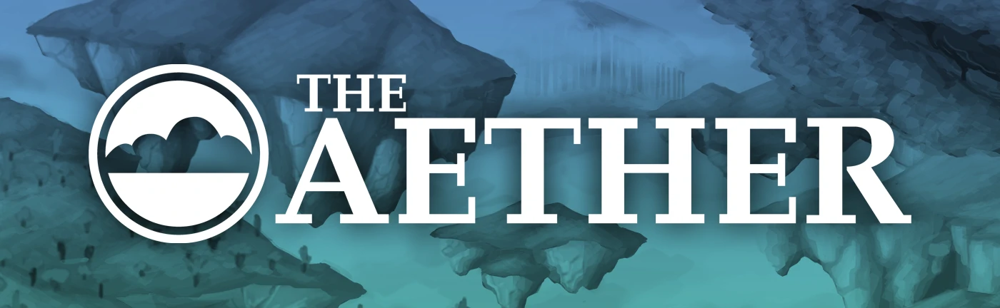

# The Aether

Gilded Games presents the original Aether mod! Up to date for modern Minecraft versions and fully compatible with multiplayer. The Aether is a dimension of floating islands high in the sky, where you can begin a new survival adventure packed with new ores, mythical creatures and perilous Dungeons! All you need to do is construct a Glowstone frame and add water to light the mystical portal, and once you step in you’ll be transported immediately to the luscious hostile paradise of the Aether! Gilded Games has ensured to maintain the Aether as close to its original state from 2011 as possible, while continuing to work on the sequel, Aether II.

## :heart: Support Gilded Games

If you enjoy our work, [please consider making a pledge](https://patreon.com/GildedGames) today to help fund development. Every pledge goes directly into our development process and services, enabling us to continue making the Minecraft mods you know and love.

You can also support the Aether project and Gilded Games by telling your friends, joining our Discord server, and sharing our progress and announcements on social media. Every bit helps!

If you're interested in sponsoring The Aether project or Gilded Games, please [contact us](mailto:support@gildedgames.com).

## :package: Download the latest releases

### Release builds
The Aether has no stable release builds for the latest version of Minecraft just yet, but this port is in active development so keep an eye out for its eventual release. If you're curious what version we're currently working on, make sure to check out the latest branch.

### Bleeding edge builds
If you’re feeling a bit more adventurous or wish to help test the in-development versions, we provide **bleeding edge builds** which are produced on [CircleCI](https://app.circleci.com/pipelines/github/Gilded-Games/The-Aether). These builds are created for every new commit and contain the latest available code. We do not recommend users treat these builds as releases, as they are unfinished and may contain serious issues. If you wish to download these builds, check out [this guide](https://github.com/Gilded-Games/The-Aether/wiki/CircleCI-Guide)

## :bug: Report bugs or other issues
If you're running into bugs or other problems, feel free to open an issue on our [issue tracker](https://github.com/Gilded-Games/The-Aether/issues). When doing so, make sure to use one of the provided templates and fill out all the requested information. Make sure to keep your issue's description clear and concise. Your issue's title should also be easy to digest, giving our developers and reporters a good idea of what's wrong without including too many details. Failure to follow any of the above may result in your issue being closed.

## :wrench: Contribute to the project
*Work in progress...*

## :scroll: License information

If you're wanting to create a gameplay video/review, extension or addon, parody, or any other fan work of your own for the Aether, go for it! We love seeing the content our community creates, and we hope to make it as welcoming as possible for everyone. 

We ask however that if you are thinking about using code or assets from The Aether project that you adhere to the licenses below, and that you please don't advertise using our brand (our specific logo assets, team name, official social media posts).
If you do have a reason that you wish to use our brand, please [contact us](mailto:support@gildedgames.com).

**All assets of The Aether for Minecraft 1.7+ (found in the [resources folder](https://github.com/Gilded-Games/The-Aether/tree/1.19/src/main/resources/assets)) are unlicensed and all rights are reserved to them by Gilded Games.** The source code of The Aether mod for Minecraft 1.7+ is under the [LGPL v3.0](https://www.gnu.org/licenses/lgpl-3.0.en.html) license. [GitHub wiki contributions](https://github.com/Gilded-Games/The-Aether/wiki) are under the [CC BY-SA 4.0 license](https://creativecommons.org/licenses/by-sa/4.0/) unless otherwise stated.

Previous versions of The Aether are not licensed freely and all rights are reserved to them by Gilded Games. Unlicensed assets are owned and copyrighted by their respective authors and all other rights to them are reserved by Gilded Games. If you would like to use
our unlicensed assets, please [get in contact with us](mailto:support@gildedgames.com) for details.

## :star2: Special mentions
### :speech_balloon: Translations
*Coming soon...*

### :hammer: Contributions
All our contributor credits can be found [here](https://github.com/Gilded-Games/The-Aether/blob/1.19/CREDITS.txt). If you contributed to the project and do not see your name, please contact us.